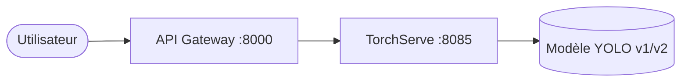

# 🚀 Déploiement YOLO avec TorchServe & Docker

**Master MLOps 2025-26** | **TP7 : Déploiement d'un modèle de Computer Vision**
**Cours par : Dr. Salah Gontara**

---

## 📋 Présentation du Projet

Ce dépôt contient le pipeline complet pour le déploiement d'un modèle **YOLO** en utilisant **TorchServe** et **Docker Compose**. L'architecture inclut une API Gateway pour simplifier les interactions et des pratiques MLOps telles que le versionnage des modèles et le rollback automatisé.

### ✨ Fonctionnalités Clés

- **Backend TorchServe** : Service d'inférence haute performance.
- **API Gateway (FastAPI)** : Interface REST conviviale pour l'utilisateur.
- **Conteneurisation Docker** : Architecture modulaire, isolée et scalable.
- **Cycle de Vie ML** : Support pour le redéploiement (v2) et le rollback.
- **Multi-Format** : Modèle disponible en PyTorch (`.pt`) et **[BONUS]** **ONNX** (`.onnx`).

---

## 🛠️ Architecture du Système



---

## 🚀 Guide de Démarrage

### 1. Préparation et Lancement

```bash
# Générer l'archive du modèle (.mar) via Docker
bash scripts/package_mar_docker.sh

# Lancer tous les services
docker compose up -d --build
```

### 2. Tester l'Inférence

**Via l'API Gateway (Recommandé) :**

```powershell
Invoke-RestMethod -Uri "http://localhost:8000/predict" -Method POST -Form @{file = Get-Item -Path "samples/street.jpg"}
```

**Via TorchServe Direct :**

```powershell
Invoke-RestMethod -Uri "http://localhost:8085/predictions/yolo" -Method POST -InFile "samples/street.jpg" -ContentType "application/octet-stream"
```

---

## 📈 Preuves de Réussite (Captures)

### Étape 4.1 : Test Direct via TorchServe (Port 8085)


### Étape 4.2 : Test via API Gateway (Port 8000)


---

## 🔄 Gestion du Cycle de Vie (CI/CD & Rollback)

### Simuler un Redéploiement (v2)

1. Remplacer `models/weights/best.pt` par les nouveaux poids.
2. Exécuter `bash scripts/package_mar_docker.sh` pour packager la v2.
3. Redémarrer le service : `docker compose restart torchserve`.

### Procédure de Rollback Simple

1. Restaurer l'ancien fichier `best.pt` ou `yolo.mar` depuis le dossier `backup/`.
2. Redémarrer les conteneurs pour recharger la version stable.

---

## 📦 Dépendances Python

**API Gateway** :

```
fastapi
uvicorn
python-multipart
requests
```

**TorchServe Handler** :

```
ultralytics
pillow
numpy
```

## 🧑‍💻 Installation Locale

```bash
# Installer les dépendances API Gateway
pip install -r api-gateway/requirements.txt
# Installer les dépendances TorchServe
pip install -r serving/torchserve/requirements.txt
```

## 🔗 Endpoints API Gateway

| Méthode | URL      | Description             | Corps attendu      | Réponse JSON           |
| ------- | -------- | ----------------------- | ------------------ | ---------------------- |
| GET     | /health  | Vérifier le backend     | -                  | {status, backend}      |
| POST    | /predict | Inférence sur une image | FormData: file=img | boxes, conf, cls, name |

**Exemple de requête :**

```powershell
Invoke-RestMethod -Uri "http://localhost:8000/predict" -Method POST -Form @{file = Get-Item -Path "samples/street.jpg"}
```

**Format de réponse :**

```json
{
    "boxes": [
        {
            "xyxy": [x1, y1, x2, y2],
            "conf": 0.98,
            "cls": 0,
            "name": "person"
        }
    ]
}
```

## 📝 Explication des Scripts

- `scripts/package_mar_docker.sh` : Génère l’archive TorchServe (.mar) via Docker.
- `scripts/smoke_test.sh` : Test rapide de l’inférence TorchServe.
- `serving/torchserve/yolo_handler.py` : Handler personnalisé pour YOLOv8.
- `api-gateway/app/main.py` : API REST FastAPI pour l’inférence.

## 🔗 Liens Utiles

- [TorchServe Documentation](https://pytorch.org/serve/)
- [YOLO by Ultralytics](https://docs.ultralytics.com/)
- [FastAPI](https://fastapi.tiangolo.com/)

## 🎁 Bonus Implémentés

- **Export ONNX** : Le modèle a été exporté vers `models/weights/best.onnx` pour une compatibilité accrue.
- **GitLab CI** : Pipeline automatisé configuré dans `.gitlab-ci.yml` pour le packaging et le build d'image.
